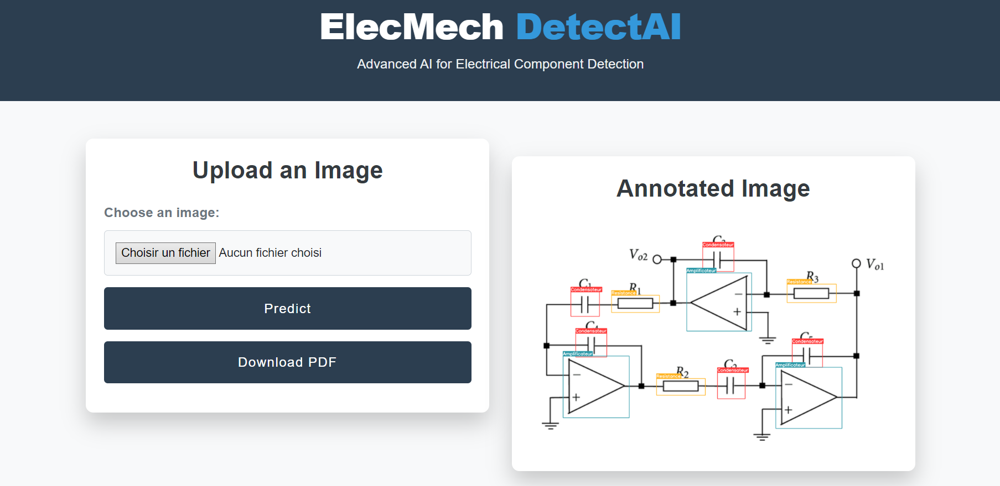
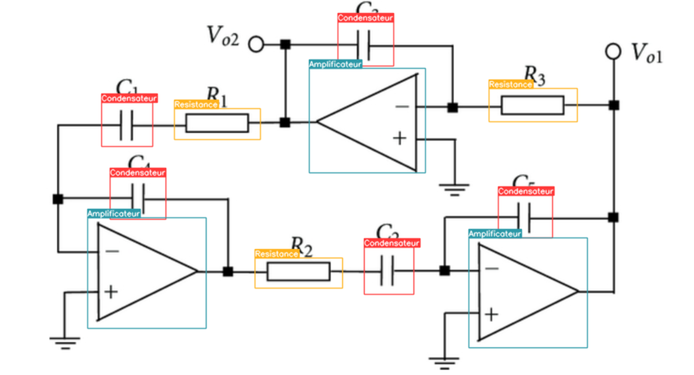

# ElecMech Readme

## Overview

Welcome to ElecMech, a project focused on developing a Deep Learning model designed to analyze 2D electronic technical drawings and identify various components within these diagrams. This readme file will guide you through the project's objectives, features, and how to run the website locally.

## Project Objectives

The primary objectives of ElecMech are as follows:

1. **Component Detection**: Implement a YOLOv8 model to detect electronic components such as 'diode,' 'coil,' 'capacitor,' 'amplifier,' and more within the technical drawings.

2. **Textual Information Extraction**: Utilize Keras OCR to extract textual information from the technical drawings, including parameters such as intensity or other relevant details.

3. **User-Friendly Interface**: Develop a user-friendly website using Django for seamless component detection. Users can effortlessly upload their technical drawings, and the model will automatically identify components. Additionally, users have the option to download a PDF containing comprehensive information about the detected components.

## How to Run the Website Locally

To run the ElecMech website on your localhost, follow these steps:

### 1. Install Required Packages

Ensure you have all the necessary packages and dependencies installed. You can do this by running:

```bash
pip install -r requirements.txt
```
### 2. Launch the Application
Once you have installed the required packages, you can launch the ElecMech website with the following command:

```bash
python manage.py runserver
```

After running this command, you should see output indicating that the server is running, along with the local address (e.g., http://127.0.0.1:8000/). Open this address in your web browser to access the ElecMech website.

That's it! You are now ready to use ElecMech to analyze electronic technical drawings and identify components with ease.

## Screenshots



